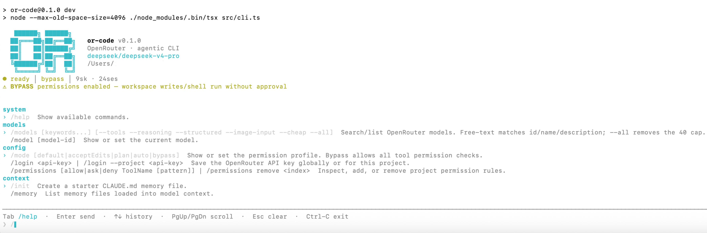

<div align="center">



# `or-code`

**The OpenRouter-native agentic coding CLI.**
**Every model. Full control. Local-first.**

[](https://github.com/EdoFendy/openrouter-code/actions)
[](https://www.npmjs.com/package/@edofendy/or-code)
[](LICENSE)
[](https://nodejs.org)
[](https://www.typescriptlang.org)
[](CONTRIBUTING.md)

`or-code` is a tiny, fast, transparent coding agent for your terminal — wired directly into [OpenRouter](https://openrouter.ai), so you can swap between **GPT-5, Claude 4.7, Gemini, Llama, Qwen, DeepSeek and 300+ other models** in a single keystroke.

No IDE plugin. No vendor lock-in. No telemetry. Just a permission-first agent loop that lives in `.orcode/`.

[**Quickstart**](#-quickstart) · [**Why or-code**](#-why-or-code) · [**Features**](#-features) · [**Docs**](docs/) · [**Roadmap**](#-roadmap)

</div>

---

## ✨ Quickstart

```bash
# 1. Install
npm install -g @edofendy/or-code

# 2. Auth
export OPENROUTER_API_KEY="sk-or-..."

# 3. Run inside any project
cd ~/my-project
or-code
```

That's it. You get a transcript-first TUI, every OpenRouter model behind `/model`, dynamic capability filters, diff-previewed writes, scoped shell, JSONL sessions and skills you can install from GitHub.

> First time? Drop in your project and try: `/models --tools --reasoning` then `/model anthropic/claude-sonnet-4.6` and ask it to *"explain the architecture and add a CHANGELOG entry"*.

---

## 🚀 Why `or-code`?

The agent CLI space is loud. Most tools either lock you to one provider, hide costs, or assume you live in their IDE. `or-code` is the opposite of that.

|                              | `or-code` | Claude Code | Cursor | Aider | Cline |
| ---------------------------- | :-------: | :---------: | :----: | :---: | :---: |
| **300+ models via OpenRouter**     |     ✅    |      ❌     |   ❌   |   ⚠️   |   ⚠️  |
| **Open source (MIT)**              |     ✅    |      ❌     |   ❌   |   ✅  |   ✅  |
| **Local-first (no cloud sync)**    |     ✅    |      ⚠️     |   ❌   |   ✅  |   ✅  |
| **Per-tool permission engine**     |     ✅    |      ⚠️     |   ❌   |   ⚠️   |   ⚠️  |
| **Lifecycle shell hooks**          |     ✅    |      ✅     |   ❌   |   ❌   |   ❌  |
| **Skills (progressive loading)**   |     ✅    |      ✅     |   ❌   |   ❌   |   ❌  |
| **JSONL session replay**           |     ✅    |      ⚠️     |   ❌   |   ⚠️   |   ⚠️  |
| **Live cost tracking + budget cap**|     ✅    |      ⚠️     |   ❌   |   ⚠️   |   ❌  |
| **No IDE required**                |     ✅    |      ❌     |   ❌   |   ✅  |   ❌  |
| **CLAUDE.md / AGENTS.md compat**   |     ✅    |      ✅     |   ❌   |   ❌   |   ⚠️  |

`or-code` is for developers who want a coding agent that is **honest about cost, explicit about permissions, model-agnostic by design, and small enough to read end-to-end** (~7k LOC of TypeScript).

---

## 🧠 Features

### Model freedom
- **Live model registry** — fetched from `GET /api/v1/models`, capabilities derived from `supported_parameters`, modalities, and pricing. No hardcoded lists.
- **Capability filters** — `/models --tools --reasoning --structured --image-input --cheap` narrows 300+ models to the ones that actually support what you need.
- **Hot-swap** — `/model openai/gpt-5-nano` mid-session. State is preserved.
- **`/why <model>`** — explain why a model passes (or fails) a filter set.

### Permission-first agent loop
- 5 modes: `default` · `acceptEdits` · `plan` (read-only) · `auto` · `bypass`
- Allow / Ask / Deny with **glob-pattern matching**: `{ "tool": "Shell", "pattern": "npm test*", "decision": "allow" }`
- Default rules block `rm -rf`, `sudo`, privilege escalation, `curl | bash`
- Workspace path validation — tools cannot escape your project root
- Built-in **secret redaction** in transcripts and JSONL

### 7 local tools, all preview-first
| Tool | What it does | Default |
|------|--------------|---------|
| `Read` | Read UTF-8 file (≤200KB) | allow |
| `ListDir` | List directory entries | allow |
| `Grep` | Regex search across workspace | allow |
| `Glob` | Fast `fast-glob` lookups | allow |
| `Edit` | String-replace with diff preview | ask |
| `Write` | Full-file write with diff preview | ask |
| `Shell` | Execute command, classified low/med/high risk | ask |

### Skills (Anthropic-compatible)
- `SKILL.md` with YAML frontmatter — drop-in compatible with `.claude/skills/`
- **Progressive disclosure**: metadata at startup → body on activation → references/scripts on demand
- Install from GitHub in one command: `or-code skills install https://github.com/foo/bar-skill`
- 10 skills ship in this repo: `caveman`, `design`, `ui-ux-pro-max`, `ui-styling`, `design-system`, `brand`, `banner-design`, `slides`, `caveman-compress`

### Lifecycle hooks
Block, observe, or augment every step with shell commands.

```jsonc
{
  "hooks": {
    "events": {
      "PreToolUse":  [{ "command": "npm run typecheck" }],
      "PostToolUse": [{ "command": "node scripts/audit.js" }],
      "UserPromptSubmit": [{ "command": "node scripts/log.js" }]
    }
  }
}
```

Events: `SessionStart`, `UserPromptSubmit`, `PreToolUse`, `PostToolUse`, `Stop`. `PreToolUse` **fails closed** unless `continueOnError: true`.

### Local-first sessions
- Append-only JSONL at `.orcode/sessions/<id>.jsonl`
- 17 structured event types (`tool.preview`, `tool.approved`, `reasoning.delta`, `model.changed`, …)
- `/resume`, `/continue`, `/compact`, `/export <path>.md`
- Session state survives crashes — restart, hit `/continue`, keep going

### Compatibility layer
- Loads `CLAUDE.md`, `.claude/CLAUDE.md`, `CLAUDE.local.md`, `AGENTS.md`, `~/.claude/CLAUDE.md` automatically
- `@path/to/file` mentions resolved before the model call
- `/init` creates a starter `CLAUDE.md` (won't overwrite)
- Skills directory layout matches Anthropic's `.claude/skills/`

### Sub-agents
- Spawn isolated agents from `.orcode/agents/*.agent.md`
- Depth-limited (≤3) so runs can't fork forever
- Per-agent model, tools, skills, `maxSteps`, `maxCostUsd`

### Cost-aware
- Header shows live USD spend per session
- `/cost` — breakdown by model
- `maxCostUsd` config — agent stops when budget hit

---

## 🖥 What it looks like

```
or-code · anthropic/claude-sonnet-4.6 · mode: default · sess: 4f2a · $0.034
─────────────────────────────────────────────────────────────────────────
> add a /version slash command and a unit test

* Thinking...
* Read result(src/commands/slash.ts, 12.4 KB)
* Grep result(/handleCommand/, 7 matches)
* Edit preview(src/commands/slash.ts, +14 −0)

  + case "/version":
  +   return { kind: "info", text: `or-code ${pkg.version}` };

  Apply edit? [y/N]
> y

* Edit applied(src/commands/slash.ts)
* Write preview(tests/version.test.ts, +18 −0)
...
```

---

## 📦 Install

```bash
# Recommended: global install
npm install -g @edofendy/or-code

# Or with pnpm / bun
pnpm add -g @edofendy/or-code
bun add -g @edofendy/or-code

# Or run from source
git clone https://github.com/EdoFendy/openrouter-code
cd openrouter-code cd openrouter-code cd or-code && npm installcd or-code && npm install npm install && npm run devcd openrouter-code cd or-code && npm installcd or-code && npm install npm install && npm run dev npm install cd openrouter-code cd or-code && npm installcd or-code && npm install npm install && npm run devcd openrouter-code cd or-code && npm installcd or-code && npm install npm install && npm run dev npm run dev
```

Requires **Node ≥ 20** (or Bun). An [OpenRouter API key](https://openrouter.ai/keys).

---

## ⚙️ Configuration

Three layers, merged in order (highest wins):

1. Process env (`OPENROUTER_API_KEY`, `OR_CODE_MODEL`, `OR_CODE_PERMISSION_MODE`)
2. Project `.env` and `.orcode/config.json`
3. Global `~/.orcode/.env` and `~/.orcode/config.json`

Minimal `.orcode/config.json`:

```json
{
  "defaultModel": "anthropic/claude-sonnet-4.6",
  "permissionMode": "default",
  "permissions": {
    "defaultMode": "ask",
    "rules": [
      { "tool": "Shell", "pattern": "npm test*", "decision": "allow" },
      { "tool": "Shell", "pattern": "rm *",      "decision": "deny"  }
    ]
  },
  "hooks": {
    "enabled": true,
    "events": {
      "PreToolUse": [{ "command": "npm run typecheck" }]
    }
  }
}
```

→ Full reference: [docs/configuration.md](docs/configuration.md)

---

## 🎯 Commands

### One-shot
```bash
or-code models --tools --reasoning   # browse capability matrix
or-code model openai/gpt-5-nano       # set default model
or-code mode plan                     # read-only mode
or-code skills install <github-url>   # install a skill
or-code resume <session-id>           # load a session
or-code export .orcode/exports/x.md   # export to markdown
or-code doctor                        # run diagnostics
```

### Slash (inside the TUI)
```
/help     /model    /models   /mode      /why        /login
/init     /memory   /permissions  /hooks  /skills    /cost
/sessions /resume   /continue  /new      /compact    /export
/clear    /status   /doctor
```

→ Full command reference: [docs/configuration.md](docs/configuration.md)

---

## 🧩 Skills

A skill is a folder with a `SKILL.md`. Frontmatter is metadata; markdown body is the actual instruction. Drop one in `.orcode/skills/my-skill/`:

```yaml
---
name: my-skill
description: One-line summary
when_to_use: When the user asks for X
allowed-tools: [Read, Edit, Grep]
---

# Body
Step-by-step playbook the agent loads only when activated.
```

→ Skill catalogue and authoring guide: [docs/skills.md](docs/skills.md)

---

## 🪝 Hooks

Hooks are shell commands. They get the event payload as JSON on `stdin` and as `OR_CODE_HOOK_PAYLOAD` env var. A non-zero `PreToolUse` blocks the tool unless `continueOnError: true`.

→ Hook recipes (auto-typecheck, format-on-write, audit log, slack notifier): [docs/hooks.md](docs/hooks.md)

---

## 🔐 Permissions

Rules are evaluated top-down, first match wins. Tool · Action · Pattern · Decision. Patterns are globs.

→ Permission cookbook: [docs/permissions.md](docs/permissions.md)

---

## 🏗 Architecture

```
┌────────────────────────────────────────────────────────────┐
│                      Ink TUI (React)                       │
│   transcript · palette · diff preview · approval · costs   │
└──────────────────────────┬─────────────────────────────────┘
                           │  events
┌──────────────────────────▼─────────────────────────────────┐
│                     Agent Runner                           │
│   @openrouter/agent loop + retry + loop-detector + hooks   │
└────┬──────────┬───────────────┬────────────┬───────────────┘
     │          │               │            │
┌────▼────┐ ┌───▼──────┐ ┌──────▼──────┐ ┌───▼────────┐
│ Tools   │ │ Skills   │ │ Permissions │ │ Sessions   │
│ Read…   │ │ progres- │ │ allow/ask/  │ │ JSONL +    │
│ Shell   │ │ sive     │ │ deny + glob │ │ state.json │
└────┬────┘ └──────────┘ └─────────────┘ └────────────┘
     │
┌────▼─────────────────────────────────────────────────────┐
│           OpenRouter /api/v1/models  +  /chat            │
└──────────────────────────────────────────────────────────┘
```

Full design doc: [docs/ARCHITECTURE.md](docs/ARCHITECTURE.md)

---

## 🗺 Roadmap

**v0.1 — shipped ✅**
- [x] Model registry with dynamic capabilities (live from OpenRouter)
- [x] Permission engine — 5 modes, ordered glob-pattern rules
- [x] 7 local tools, all preview-first (Read / Write / Edit / Grep / Glob / ListDir / Shell)
- [x] JSONL sessions — resume / continue / compact / export
- [x] Skills — progressive disclosure, GitHub install, 9 bundled
- [x] Lifecycle hooks — 5 events, PreToolUse fail-closed
- [x] Ink TUI — streaming, diff preview, palette, cost header
- [x] Sub-agents — depth-limited, per-agent model/tools/budget
- [x] Secret redaction in transcripts
- [x] CLAUDE.md / AGENTS.md compatibility
- [x] Open-source release (MIT, full docs, issue templates, CI)

**v0.2 — next 🚧**
- [ ] **`npm install -g @edofendy/or-code`** — public npm release, `npx` support
- [ ] First-class approval queue with `/approve` and `/deny`
- [ ] `or-code --version` flag
- [ ] Session pruning (`/sessions prune`)

**v0.3 — soon**
- [ ] Saved model presets + latency/cost sorting in `/models`
- [ ] Stronger diff engine (hunks + binary detection)
- [ ] Eval corpus (offline · 4xx/5xx · refresh/resume · double-submit)

**v1.0 — future**
- [ ] Allow rules scoped by file checksum / command hash
- [ ] Sandbox profiles for tool isolation
- [ ] MCP server compatibility
- [ ] Signed releases + provenance

---

## 🤝 Contributing

PRs, issues, model recommendations, and skill submissions all welcome. Start with [CONTRIBUTING.md](CONTRIBUTING.md).

```bash
git clone https://github.com/EdoFendy/openrouter-code
cd openrouter-code cd or-code && npm installcd or-code && npm install npm install
npm run check   # typecheck + lint + test + build
```

Please read [CODE_OF_CONDUCT.md](CODE_OF_CONDUCT.md). Security issues → [SECURITY.md](SECURITY.md).

---

## 💡 Inspiration & credits

Built on the shoulders of:
- [`@openrouter/agent`](https://www.npmjs.com/package/@openrouter/agent) — the loop, streaming, and provider routing
- [Anthropic Skills](https://docs.claude.com) — `SKILL.md` format and progressive disclosure idea
- [Ink](https://github.com/vadimdemedes/ink) — React in the terminal
- [Zod](https://zod.dev) — runtime types we trust

`or-code` is **compatible by behaviour** with Claude Code's CLAUDE.md, AGENTS.md, hooks and skills layouts. It is not a fork; it has no Anthropic code.

---

## 📜 License

[MIT](LICENSE) © 2025 `or-code` contributors.

<div align="center">

**If `or-code` saves you a context-switch, give it a ⭐ — it really helps.**

[Report a bug](https://github.com/EdoFendy/openrouter-code/issues/new?template=bug_report.yml) ·
[Request a feature](https://github.com/EdoFendy/openrouter-code/issues/new?template=feature_request.yml) ·
[Discussions](https://github.com/EdoFendy/openrouter-code/discussions)

</div>
